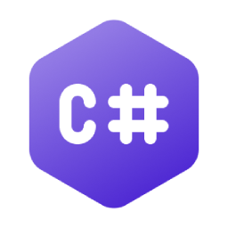
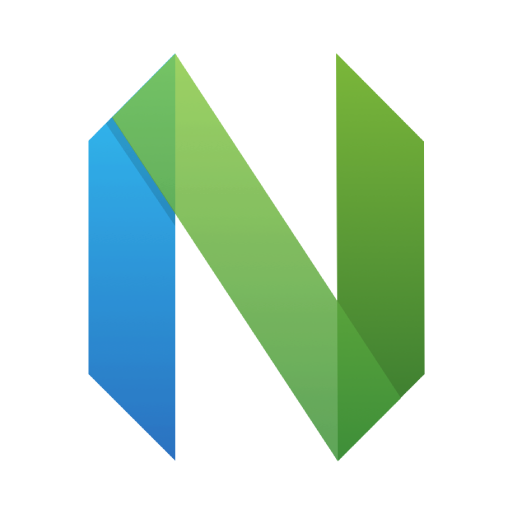
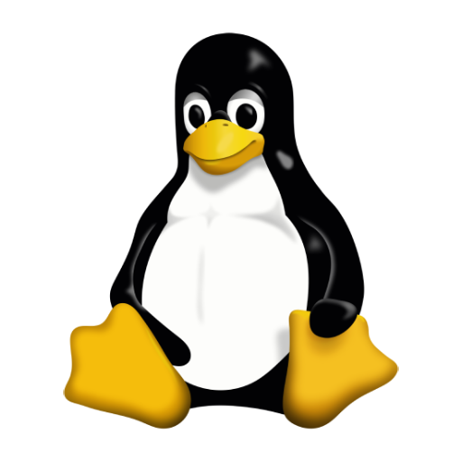

<!-- ## BluDay's [_Installation_](https://www.halopedia.org/Halo_Array) -->

Software engineer and lifelong skateboarder from [_Älta_](https://en.wikipedia.org/wiki/%C3%84lta), with 12+ years of coding experience. Began coding at age 14.

Call me BluDay or _Noah_.

- Former Windows Phone and UWP application developer
- Current focus: desktop application development for Windows using WinUI 3 (Windows App SDK) and WPF
- Favorite language: C#
- Fun fact: Used to play [_Halo: Combat Evolved_](https://en.wikipedia.org/wiki/Halo%3A_Combat_Evolved) at age 3 in 2002

### Tech stack

    
    
    
    
    
    
    
    
    
    
    

### Contact info

<!-- [Contact me](mailto:bluday.subsystem284@passinbox.com) -->

bluday.subsystem284@passinbox.com
