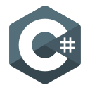

<!-- ## 🫐 Welcome to BluDay's [_Installation_](https://www.halopedia.org/Halo_Array) 🫐 -->

_BluDay_ — Computer programmer and skateboarder from [_Älta_](https://en.wikipedia.org/wiki/%C3%84lta).

- Favorite language: C#
- Preferred languages in order: C#, Python, Rust, C
- Experience: 12+ years in .NET development, specializing in desktop applications
- Fun fact: Played _Halo: Combat Evolved_ on the original _Xbox_ by myself as a 3 year old in 2002

Currently focused on WinUI 3 and WPF development, while learning Rust.

### Tech stack

  
  
  
  
  
  <!--
  
  
  -->

### Contact info

bluday.subsystem284@passinbox.com
