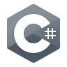

<!--
## 🫐 Welcome to BluDay's [_Installation_](https://www.halopedia.org/Halo_Array) 🫐

-->

BluDay — a software engineer and lifelong skateboarder from [_Älta_](https://en.wikipedia.org/wiki/%C3%84lta).

- Favorite language: C#
- Experience: 12+ years in .NET development with a focus on desktop applications
- Fun fact: At age 3 in 2002, I often started up my original Xbox on my own to play _Halo: Combat Evolved_

### Tech stack

  
  
  
  
  
  
  
  

### Contact info

bluday.subsystem284@passinbox.com

